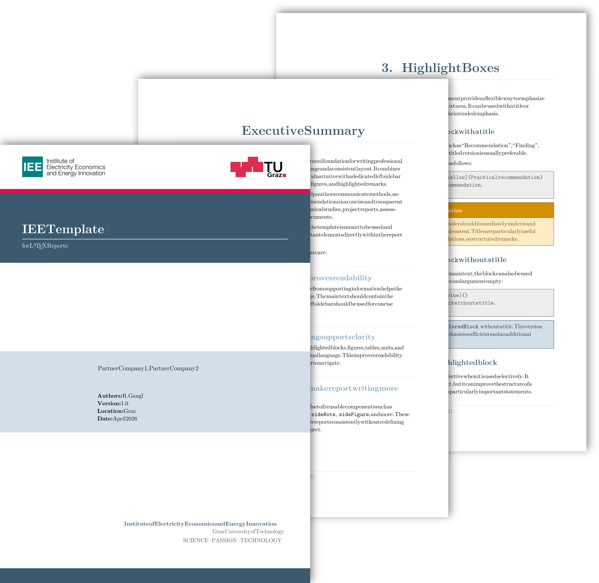

# IEE LaTeX Report Template

This repository contains a **LaTeX report template** developed by the Institute of Electricity Economics and Energy Innovation (IEE) at Graz University of Technology. It provides a consistent and professional design style for reports, studies, project documents, and technical write-ups related to the institute's courses, research activities, and collaborations.

   
  <b>Figure 1.</b> Example pages of the IEE report template.

## How to use?
1) Download the ZIP file by clicking the green "**Code**" button and selecting "**Download ZIP**".
2) Depending on your LaTeX editor:
   - **Overleaf**: Click **New Project** > **Upload Project**, then select the downloaded ZIP file.
   - **Other LaTeX editors**: Extract the ZIP file and open the files in your preferred editor.
3) Read the content of the template carefully. It explains the intended structure of an IEE report and demonstrates how to use the most important commands, environments, and layout elements.

## Overview

The template includes:

- A custom report style tailored to IEE's branding and layout philosophy.
- A sidebar-based page design with a dedicated left column for compact supporting information.
- Example chapters that explain how to use the template and illustrate typical report elements such as figures, tables, icons, highlighted boxes, references, and units.

## Features

- Create highlighted content in the main text using `\begin{coloredBlock}` with or without a title.
- Use the `sideBlock` environment to place framed highlighted content in the left sidebar.
- Use the `sideNote` environment for concise sidebar notes without a frame.
- Insert icons into the sidebar using `\sideIcon` or directly into titles of `coloredBlock` environments.
- Use `\ieesidefigure` for compact figures in the sidebar and `\ieesidetable` for small sidebar tables.
- Include full-width figures that extend beyond the main text column while preserving the overall page design.
- Format numbers and units consistently with `siunitx`.
- Generate a consistent cover page and imprint page with `\makeieecover` and `\makeieeimprint`.

## Sidebar concept

The page layout is intentionally asymmetric:

- about **2/3 of the page** is used for the main text block on the right
- about **1/3 of the page** is reserved on the left for a sidebar / margin column

The left sidebar is intended for:

- assumptions
- recommendations
- definitions
- contextual notes
- icons
- small figures
- small tables

The main text area should contain the central narrative of the report.

## Release Notes
- **2026-04-01:**
   - First upload.